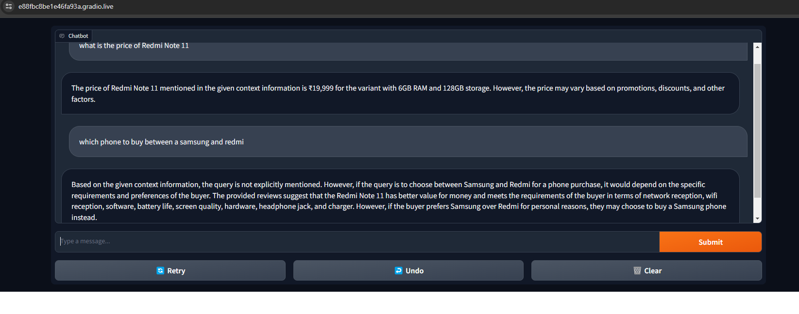

# HAL56
# Llama Index Gradio Interface

This project provides a simple Gradio interface for using the Llama Index, a versatile library for semantic search. This interface allows you to interact with the Llama Index through a chat-like interface using the Gradio library.



[


## Getting Started

### Prerequisites

- Make sure you have Python installed (version 3.6 or above).

### Installation

1. Clone the repository:

   ```bash
   git clone https://github.com/Saideep-23/HAL56.git
   cd HAL56
pip install -r requirements.txt
mkdir sample_data
# Place your sample documents in the sample_data directory
python your_script_name.py


## Code Explanation

The provided code sets up a Gradio interface for interacting with the Llama Index. Here's a brief explanation of the key components:

### Llama Index Initialization:
- The code initializes the Llama Index using the `VectorStoreIndex`, `SimpleDirectoryReader`, and `ServiceContext` classes.
- It loads sample data from the `sample_data` directory.

### LlamaCPP Configuration:
- Configures the LlamaCPP model with various parameters such as temperature, max_new_tokens, and more.

### Service Context Setup:
- Creates a `ServiceContext` with default settings, specifying the chunk size, LlamaCPP model, and embedding model.

### Rerank Model Setup:
- Initializes a `SentenceTransformerRerank` model for reranking search results.

### Query Engine Setup:
- Configures the query engine with similarity settings and node postprocessors, including the previously defined rerank model.

### Prediction Function:
- Defines a prediction function that queries the Llama Index and returns the response.

### Gradio Interface Launch:
- Uses Gradio to launch a chat interface for the prediction function.
